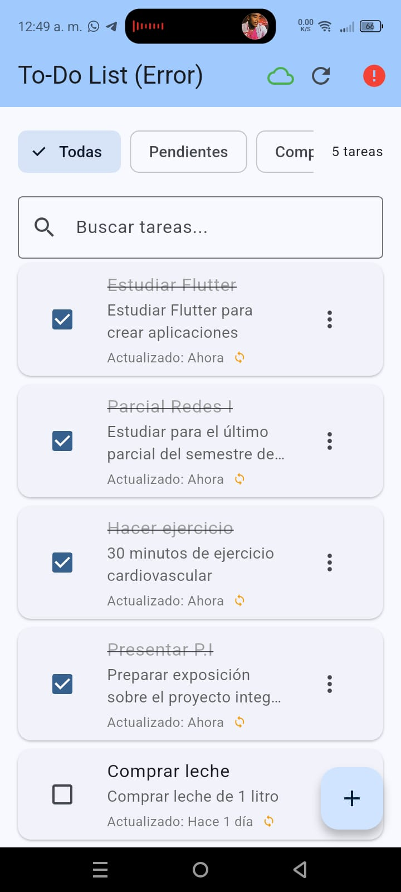

# Gestor de Tareas - Flutter App

Aplicación móvil Flutter de gestión de tareas con arquitectura limpia, persistencia local SQLite y modo offline con sincronización automática.

## 📱 Características

- ✅ **Gestión completa de tareas**: Crear, editar, marcar como completadas y eliminar
- 🔄 **Modo offline-first**: Funciona sin conexión y sincroniza automáticamente
- 💾 **Persistencia local**: Base de datos SQLite con esquema optimizado
- 🌐 **API REST integration**: Mock API con endpoints completos
- 📊 **Filtros avanzados**: Todas, pendientes, completadas
- 🔄 **Sincronización automática**: Detección de conectividad y cola de operaciones
- ⚡ **Arquitectura limpia**: Separación por capas con Provider

## 🏗️ Arquitectura y Tecnologías

### Stack Tecnológico
- **Flutter 3.x** - Framework de desarrollo multiplataforma
- **Provider** - Gestión de estado
- **sqflite** - Base de datos SQLite local
- **connectivity_plus** - Detección de conectividad
- **http** - Cliente HTTP para API REST
- **json-server** - Mock API para desarrollo

### Arquitectura
```
lib/
├── data/                    # Capa de datos
│   ├── local/              # Persistencia local
│   │   ├── database_service.dart
│   │   └── memory_database.dart
│   ├── remote/             # API remota
│   │   └── api_service.dart
│   └── repositories/       # Repositories (patrón repository)
│       └── mock_task_repository.dart
├── models/                 # Modelos de datos
│   └── task.dart
├── providers/              # Gestión de estado (Provider)
│   └── task_provider.dart
├── screens/                # Interfaces de usuario
│   └── task_list_screen.dart
└── main.dart              # Punto de entrada
```

## 📁 Estructura de Carpetas y Capas

### Capa de Presentación (`screens/`, `providers/`)
- **TaskListScreen**: Interfaz principal con lista de tareas y filtros
- **TaskProvider**: Gestión de estado con Provider, manejo de errores y sincronización

### Capa de Datos (`data/`)
- **DatabaseService**: Abstracción de SQLite con soporte multiplataforma
- **ApiService**: Cliente HTTP para comunicación con API REST
- **MockTaskRepository**: Implementación del patrón Repository con estrategia offline-first

### Capa de Modelos (`models/`)
- **Task**: Modelo de datos con serialización JSON y validación

## 🚀 Instalación y Ejecución

### Prerrequisitos
- Flutter SDK 3.x+
- Android Studio / VS Code con Flutter extension

### Pasos de Instalación

1. **Clonar el repositorio**
```bash
git clone <https://github.com/AlejoHV/Gestores-estado.git>
cd gestor_estado
```

2. **Instalar dependencias Flutter**
```bash
flutter pub get
```

3. **Iniciar Mock API**
```bash
# En terminal separado
npm install -g json-server
json-server --watch db.json
```

4. **Ejecutar aplicación**
```bash
# Para desarrollo
flutter run

# Para construir APK
flutter build apk --release
```

### Variables de Configuración
- La API mock corre en `http://localhost:3000`
- Base de datos local SQLite en almacenamiento del dispositivo
- Configuración automática de plataforma (Android/iOS/Desktop)

## 📱 Modo Offline y Sincronización

### Estrategia Offline-First
1. **Lecturas**: Datos locales mostrados inmediatamente, refresco en segundo plano si hay conexión
2. **Escrituras**: Guardado local instantáneo, encolado para sincronización posterior

### Tablas de Base de Datos
```sql
-- Tabla de tareas
CREATE TABLE tasks (
  id TEXT PRIMARY KEY,
  title TEXT NOT NULL,
  completed INTEGER NOT NULL DEFAULT 0,
  updated_at TEXT NOT NULL,
  deleted INTEGER NOT NULL DEFAULT 0
);

-- Tabla de cola de sincronización
CREATE TABLE queue_operations (
  id TEXT PRIMARY KEY,
  entity TEXT,
  entity_id TEXT,
  op TEXT,               -- CREATE | UPDATE | DELETE
  payload TEXT,
  created_at INTEGER,
  attempt_count INTEGER,
  last_error TEXT
);
```

### Flujo de Sincronización
1. **Detección automática** de conectividad con `connectivity_plus`
2. **Procesamiento de cola** con backoff exponencial
3. **Resolución de conflictos** con estrategia Last-Write-Wins
4. **Actualización automática** de la interfaz

### Cómo Probar Modo Offline

#### Usando Modo Avión:
1. Inicia la aplicación con conexión activa
2. Activa modo avión en tu dispositivo
3. Realiza operaciones (crear, editar, eliminar tareas)
4. Observa que las operaciones se guardan localmente
5. Desactiva modo avión y observa la sincronización automática

#### Indicadores Visuales
- **Icono de conectividad** en la interfaz
- **Indicadores de sincronización** en cada tarea
- **Mensajes de error** con retroalimentación clara

## 🔧 Desarrollo y Testing

### Configuración Multiplataforma
- **Android**: SQLite nativo con configuración Gradle específica
- **Windows**: SQLite FFI con `sqflite_common_ffi`

## 📸 Capturas de Pantalla



### Vista Principal
- Lista de tareas con filtros
- Indicadores de conectividad
- Botón flotante para crear tareas

### Modo Offline
- Indicadores visuales de sincronización pendiente
- Operaciones locales funcionando sin conexión

### Sincronización
- Progreso de sincronización automática

## 🎯 Requisitos Técnicos Cumplidos

- ✅ Flutter 3.x con Provider para gestión de estado
- ✅ Arquitectura limpia con separación de capas
- ✅ Integración API REST con mock server
- ✅ Persistencia SQLite con esquema optimizado
- ✅ Modo offline-first con sincronización automática
- ✅ Manejo de errores y retroalimentación usuario
- ✅ APK funcional para Android
- ✅ Multiplataforma (Android + Windows)
